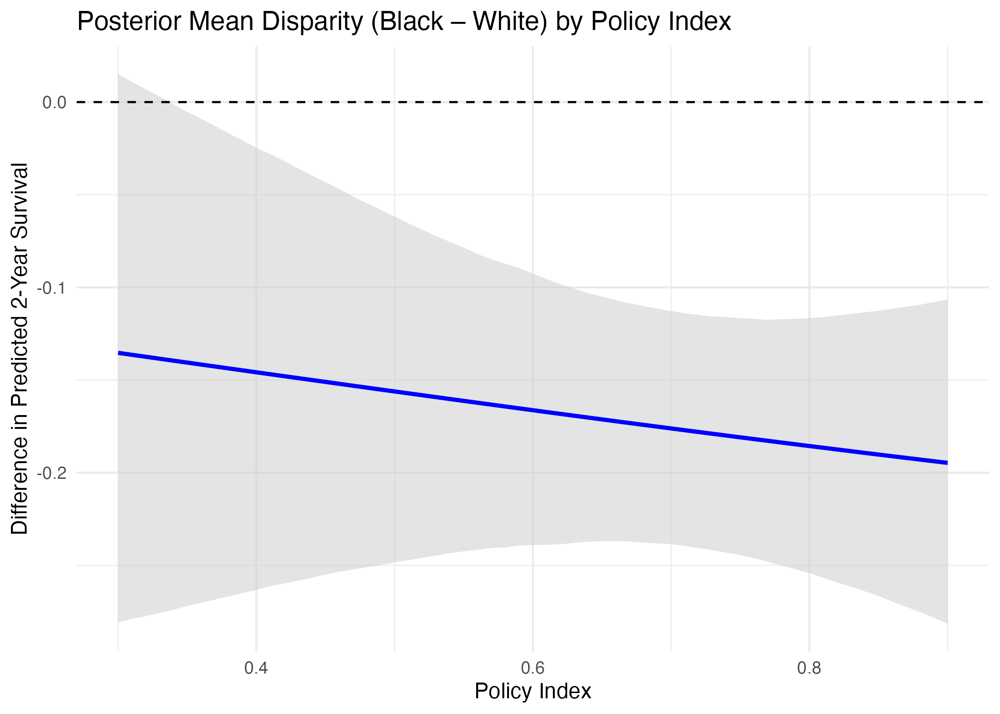

# README: Survival Disparities Model (Black vs White)

This script runs a Bayesian logistic regression to estimate Black–White disparities in 2-year survival across different levels of a city-level policy index.

## What the code does

1. **Simulates example data** to demonstrate the structure and expected variables.  
   (We'll eventually replace this with the real CCR dataset.)

2. **Imputes missing data** using `mice`.

3. **Fits a Bayesian model** using `brms` with:
   - Outcome: `survived_2y` (1 = yes, 0 = no)
   - Key predictors: `race`, `policy_index`, and their interaction
   - Covariates: `age`, `sex`, `insured`, `married`
   - Random intercept for `city_id`

4. **Predicts survival probability** across a range of policy index values, separately for Black and White adults.

5. **Calculates the disparity** (Black minus White) in predicted survival for each policy level.

6. **Saves results** as:
   - `model_black_white_survival.rds` = fitted model
   - `disparity_black_white_over_policy.rds` = summarized results
   - `plot_black_white_disparity.png` = figure
   - `table2_posterior_effects.csv` = model coefficients

---
## Results Summary
The figure below shows the posterior mean difference in predicted 2-year survival between Black and White individuals across a range of city-level policy index values.
In this simulated example, Black individuals have lower predicted survival probabilities than White individuals across all policy index values. As the policy index increases (representing more supportive policy environments), the disparity narrows but does not disappear. The shaded band shows the 95% credible interval for the difference.

This output was generated from simulated data. 



---

## To run the analysis with real instead of simulated data:

In the script, find this line:

```r
sim_data <- real_data_frame
```

Uncomment and replace it with the actual data. The dataset should have the following variables or something similar:

| Variable       | Description                          |
|----------------|--------------------------------------|
| `survived_2y`  | Binary outcome: survived = 1, else 0 |
| `race`         | Should include at least Black + White |
| `policy_index` | Numeric score for each city          |
| `age`          | Age in years                         |
| `sex`          | "Male" or "Female"                   |
| `insured`      | "Yes" or "No"                        |
| `married`      | "Yes" or "No"                        |
| `city_id`      | City identifier                      |

### Notes

- `policy_index` should be **city-level**, but included (i.e., merged in already) in the person-level dataset. I will provide this once it's done. 
- Make sure all categorical variables are coded as factors.

